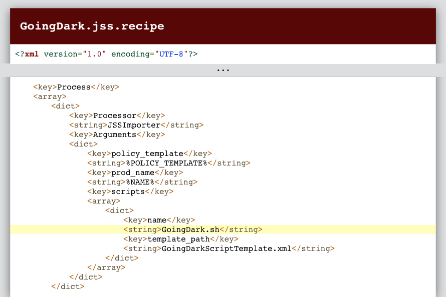

# How (Not) To Do Bad Things With AutoPkg  <!-- omit in toc -->

_Originally presented by Elliot Jordan at the [Mac Admin & Developer Conference UK](http://www.macad.uk/) in London on February 10, 2016._

- [Overview](#overview)
- [The Bad Things](#the-bad-things)
  - [1. Deleting things](#1-deleting-things)
  - [2. Overwriting things](#2-overwriting-things)
  - [3. Fun with processors](#3-fun-with-processors)
  - [4. Naming curiosities](#4-naming-curiosities)
  - [5. Surprise variables](#5-surprise-variables)
  - [6. Surreptitious scripts](#6-surreptitious-scripts)
  - [7. Trust without verification](#7-trust-without-verification)
  - [8. Plain boring typos](#8-plain-boring-typos)
  - [9. Technical confusion](#9-technical-confusion)
  - [10. Find/replace flubs](#10-findreplace-flubs)
  - [11. Loose licensing](#11-loose-licensing)
  - [12. Software regression](#12-software-regression)
  - [13. Side-loading and hijacking](#13-side-loading-and-hijacking)
  - [14. Administrative fatigue](#14-administrative-fatigue)
  - [15. Over-automation](#15-over-automation)
- [Tips For Avoiding the Bad Things](#tips-for-avoiding-the-bad-things)
  - [Don't run AutoPkg as root](#dont-run-autopkg-as-root)
  - [Read and write recipes](#read-and-write-recipes)
  - [Isolate your AutoPkg Mac](#isolate-your-autopkg-mac)
  - [Verify code signatures](#verify-code-signatures)
  - [Pay attention to changes](#pay-attention-to-changes)
  - [Use overrides liberally](#use-overrides-liberally)
  - [Mass edit with caution](#mass-edit-with-caution)
  - [Inspect packages before deploying](#inspect-packages-before-deploying)
  - [Don't deploy directly to production](#dont-deploy-directly-to-production)
  - [Documentation, of course](#documentation-of-course)
  - [The principle of least privilege](#the-principle-of-least-privilege)
- [Conclusion](#conclusion)
- [Links Mentioned During My Session](#links-mentioned-during-my-session)

## Overview

Like many of you, my life has been made easier thanks to the Mac software packaging automation tool [AutoPkg](https://autopkg.github.io/autopkg/). We've been hearing about how great AutoPkg is for years (spoiler alert: it's great), but we haven't always heard how to avoid common pitfalls and use AutoPkg safely. That's the topic I'm hoping to crack open — "how (not) to do bad things with AutoPkg."

That's a cheeky title, of course. As you might expect, in order to show you how _not_ to do bad things, I have to show you how one would _do_ a few bad things first. But it goes without saying that I expect you to use your newfound knowledge only for good, never for evil.

Although none of these ideas are truly new, my goal is to collect the most practical ideas into a central location that Mac admins worldwide can draw from and improve upon. I welcome your comments (and pull requests) and hope to improve this collection over time.

## The Bad Things

### 1. Deleting things

When I started brainstorming ideas for my presentation today, I immediately thought of the [PathDeleter](https://github.com/autopkg/autopkg/wiki/Processor-PathDeleter) processor.

This processor has many legitimate uses, and is often great at cleaning up leftover junk when software needs repackaging, like this portion of my [ApacheDirectoryStudio package recipe](https://github.com/autopkg/homebysix-recipes/blob/master/Apache/ApacheDirectoryStudio.pkg.recipe):

However, it's not hard at all to make PathDeleter counterproductive. For example, here's part of a recipe that builds up a shiny new package with PkgCreator, then deletes it straightaway with PathDeleter.

Typically, PathDeleter deletes things inside of the `RECIPE_CACHE_DIR` folder. But guess what? PathDeleter doesn’t really care about the `RECIPE_CACHE_DIR`. It’s perfectly happy deleting any files or folders it has access to, if you ask it to.

For example, here's part of a recipe that deletes all my overrides.

Let's keep climbing this ladder for a moment, to see what we can delete. Here's one that uses PathDeleter to delete any photo libraries in my ~/Pictures folder.

But of course, that recipe is only harmful for people named Elliot. Why discriminate? Let's make it harmful for everyone!

Using this very simple processor, I can derive the current username and pass that along to PathDeleter.

Let’s try to delete something bigger, like my entire user folder.

Fortunately, ACLs mostly prevent this from happening. Certain folders have an “everyone deny delete” ACE set — that’s why you see “this folder is required by OS X” when you try to delete them in the Finder.

Similarly, we're not able to delete folders that we don't own, like the Applications folder.

Save that thought, though. We'll come back to this idea later.

Here's an example of a folder that doesn't have any special protections, is usually owned by the current user, and contains very important things on Macs running AutoPkg: /usr/local

Of course, that's the folder that contains the symlink that adds autopkg to your `$PATH` env variable, and probably holds a few other important binaries as well. (`jamf` binary, anything installed with Homebrew.) So when we run our next AutoPkg recipe:

No such file or directory. May that virtual machine rest in peace.

Thus far, the only things we've deleted have been on our local AutoPkg Mac. But there's also a folder that your currently logged in user often has access to: your Munki repo.

Ouch. So now we've affected both our AutoPkg Mac and the software distribution system itself. We'll go even farther soon.

### 2. Overwriting things

But let’s be real — messing with PathDeleter is pretty obvious. Things can be deleted in a more subtle way. For example, have a look at the Copier processor. You wouldn’t think at first glance that you could lose anything by making a copy, but check out the input variables.

If “overwrite” is set, Copier overwrites files that already exist at the destination path. And like PathDeleter, that destination path is usually in the `RECIPE_CACHE_DIR` folder, but doesn’t have to be.

Here's an example of a recipe that uses Copier to overwrite our Munki repo, which has the same effect as deleting it outright.

In fact, there are a bunch of processors that, if given specific input, will happily overwrite files in their way.

| Processor          | Can overwrite files? | Can overwrite folders? |
| ------------------ | -------------------- | ---------------------- |
| CURLDownloader     | __Yes__              | No                     |
| DmgCreator         | __Yes__              | No                     |
| FileCreator        | __Yes__              | No                     |
| FileMover          | __Yes__              | No                     |
| FlatPkgPacker      | __Yes__              | No                     |
| FlatPkgUnpacker    | __Yes__              | __Yes__                |
| Installer          | __Yes__              | __Yes__                |
| InstallFromDMG     | __Yes__              | __Yes__                |
| PkgCopier          | __Yes__              | __Yes__                |
| PkgCreator         | __Yes__              | __Yes__                |
| PkgInfoCreator     | __Yes__              | No                     |
| PkgPayloadUnpacker | __Yes__              | __Yes__                |
| PkgRootCreator     | __Yes__              | __Yes__                |
| Symlinker          | __Yes__              | No                     |
| Unarchiver         | __Yes__              | __Yes__                |
| URLDownloader      | __Yes__              | No                     |

Using these core processors and the proper input variables, we can delete _anything_ that I demonstrated earlier using PathDeleter, without shouting "I'm deleting things" to people reading the recipe.

### 3. Fun with processors

But why limit ourselves to core processors? We can write our own processors and do whatever we want. AutoPkg processors are basically Python modules, after all.

Remember when we tried to use PathDeleter to delete the User folder, and ACLs and permissions stopped us? We can try to get around that on the /Applications folder by building a processor that runs `sudo rm -rf /Applications`. I named it "DeleteAppFolder," but you can name it whatever you like.

When it runs, it asks for my password. The reason it asks for my password is because the processor itself prefixes the command with `sudo`. After I enter my password, my applications disappear one by one. (Note: This doesn't work on 10.11 due to System Integrity Protection, which is a good thing.)

I've written a processor that can modify (e.g. _hijack_) our DNS servers.

It shows a security authorization box if you're running AutoPkg as the current user. Running AutoPkg with sudo (which you should never do) doesn't even show you the authorization box.

Once we've pointed our DNS to a server we control, we can point our AutoPkg Mac wherever we want it to go. Instead of getting your latest Flash or Firefox software from the software developer, it might start pulling the software from an illegitimate source. And maybe you disabled code signature verification a while back because of some recurring errors, and you forgot to turn it back on when the errors went away? This could easily be a contributing factor for major trouble.

Here are two other custom processor ideas so devious I didn't even want to write the code for them.

- First, how about a processor that uses `curl` to send your JSS API credentials to a third party server. You didn't use your full JSS admin account credentials when you set up AutoPkgr, right? Right?
- Or how about a processor that seems to do what it says on the box, but also takes keys from ~/.ssh and uploads them to a server. That's scary.

### 4. Naming curiosities

By this I'm referring to the way that AutoPkg identifies and runs recipes and processors. By default, a `RECIPE_SEARCH_DIRS` defaults setting specifies where AutoPkg searches for recipes, and in what order.

But if we have a repo earlier in the search path, we can basically hijack a recipe that comes later in the search path by using the same name or identifier. Here I've made a copy of the Firefox recipe in a folder earlier in the search path, with some small modifications. Since my recipe is earlier in the search path, the command `autopkg run Firefox.munki` will run my recipe, not the one from the `recipes` repo.

The same goes for if I have a recipe override using Firefox's recipe identifier as the ParentRecipe. That override now has a new parent. An "EvilStepParentRecipe," maybe?

We can do a similar thing with processors too. If a referenced processor is in the same directory as the recipe that references it, AutoPkg will run it — even if it has the same name as a core processor. So that presents a compelling option if a bad actor wanted to obfuscate a custom processor.

On a seemingly unrelated note: did you know that capital letters come before lowercase letters, according to bash and python? Interesting. Very interesting.

### 5. Surprise variables

Perhaps you already know that there's a way to override AutoPkg recipe input variables at runtime by using the `-k` flag for the `autopkg` command. And since many recipes use input variables for things like the download URL, and Sparkle feed, we can cause some confusion with that.

This is an example of me running the ADPassMon recipe, but actually downloading MunkiAdmin instead, just by injecting some variables.

### 6. Surreptitious scripts

So we've had our fun messing with things on our AutoPkg Mac. But that doesn't concern you much. You can probably just rebuild it.

Well then let's have some fun with client-side scripts. It's actually quite a bit easier than making a custom processor.

For Munki recipes, scripts can live in the recipe itself. For pkg recipes, scripts can live in a Scripts folder (which doesn't need to be called Scripts). And JSS recipes (with the proper template) can create extension attributes, which typically only `echo` a small piece of information, but nothing prevents them from running arbitrary code as root when `jamf recon` runs.

Take a look at this one, which I call GoingDark. A postinstall script is added that actually removes the Munki client tools.

An equivalent for our colleagues using Casper. It creates a policy that runs a script that uninstalls the Casper framework. It even removes CasperCheck, if you have that installed. And disables SSH and ARD so you can't easily re-enroll without physical access to the Mac.

Your computers run this, and they never check in again. That'll send the IT department into a panic, no doubt.

For an even more startling example, check this out. This script creates a new account, enables FileVault only for that account, and immediately restarts.

For a more subtle effect, the postinstall script could be used to delete almost anything (since it runs as root) or to install a keylogger, hijack DNS, or other nefarious tasks. Anything, really.

So I think I've made my point. With the right Python code you can tell AutoPkg to do pretty much anything. But most of those examples are deliberately doing stupid things, or intentionally malicious. You say: "I'm a good person and I'm not going to do malicious or stupid things, so this won't happen to me."

Sure, that's great! Let's assume for the moment that you're never going to intentionally do something stupid with AutoPkg. That doesn't protect you from other people's malice or ignorance.

### 7. Trust without verification

Do you trust everyone whose recipes and processors you're using? Do you personally know them from meeting them at conferences like this one, and have deemed them capable, benevolent, and mentally stable?

Let's assume yes. What about the ones who get a repo in the autopkg organization tomorrow, next week, or next year? Let's be honest: there's a pretty low bar for entry. Make a repo with a few recipes, and ask to be forked. With access to the autopkg organization, a would-be attacker has direct and indirect access to thousands of computers at companies around the world.

But let's also assume that everyone in the autopkg organization is trustworthy. Do you know for sure that they use good passwords? Do they have two-factor authentication turned on for their GitHub accounts? What if their Mac gets stolen and their password gets brute forced? What if their GitHub account gets hacked?

Related question: How many of us actually look at the changes each time we do `autopkg repo-update`? Every time?

If you're using an app like AutoPkgr, chances are even lower that you're watching for changes. AutoPkgr ships with this checkbox off, but I'd wager that most people turn it on because it's so darn convenient:

But remember all that malicious fun we had with recipes and processors a few minutes ago? Deleting, overwriting, hijacking, and generally messing with things? __Not paying attention to repo updates is the prime way that these things can sneak past you__. And suddenly your company is on the front page, and not in a good way.

Sounds like the plot of a movie, right? Probably wouldn't happen in real life. I'm sure we'll all be _just fine_.

So then if we're still assuming things (which we shouldn't), and we assume that we're safe from malicious intent (which we aren't), then how do these supposed bad things actually happen?

Lots of ways! I've got 7 more "bad things" to go, and they're all about __accidents and oversights__, not straight up malice.

Starting with...

### 8. Plain boring typos

Going way back to our first PathDeleter examples, it's hard to imagine that a recipe author would try to intentionally delete your iPhoto library, right? Fair enough. But it's relatively easy to make a typo in a recipe.

In almost all cases AutoPkg catches the typo and aborts the recipe run, but it's not hard to imagine that a typo could contribute to problems that are harder to detect, like a poorly constructed package or an incorrect version string.

But let's keep moving. There are plenty of other accidents that we can inflict upon ourselves.

### 9. Technical confusion

An environment using AutoPkg can be complex. And perhaps the people who configured the system aren't the same people who administer it day to day. Consider the following situations:

You have a manifest called `developers` in Munki for your software engineers. Most of your recipes go into a "testing" catalog, and are promoted to "stable" after you certify that they're all good.

But somebody just added a new recipe, and the recipe author chose to put the recipe into a catalog called "development." Normally you'd want to override this, but the new guy doesn't know that. So it creates a catalog in your repo called "development" when it runs.

The new guy pokes around and sees that the "developers" manifest doesn't include the "development" catalog. That seems odd, right? So he adds the "development" catalog to the "developers" manifest. Problem solved.

Except now your developers are going to receive the latest version of the app immediately after it's released, before any testing is done, and without any warning at all.

Best case scenario: it's confusing for the Munki administrators who try to untangle this later without the proper documentation. Worst case scenario: A bug in the app gets deployed to production and the developers can't use the app.

Here's another scenario. You add Firefox.jss to your recipe run list. But unbeknownst to you, there are two different Firefox.jss recipes. One of them includes a pre-install script that removes Firefox before installing the new version.

However, because of out-of-date inventory information on your JSS, this package gets scoped to computers that already have a newer version of Firefox installed. The preinstall script runs, but the actual Firefox installation fails, leaving the target computers without Firefox at all.

(This is based on a true story reported on the MacAdmins Slack team.)

Many other examples can be derived from the somewhat complex relationships between the tools that power the process of connecting AutoPkg to Casper. You want to add a JSS recipe. Did you already install and configure JSSImporter? What account are you using to connect to your JSS? Does the app you need have a recipe already? If so, which repo is it hosted in? How does it behave when it runs?

The recipes in __jss-recipes__ behave consistently, but not all jss recipes are in __jss-recipes__. What's an aspiring Mac admin to do?

### 10. Find/replace flubs

As somebody who maintains a lot of AutoPkg recipes, I know this first-hand. Learn from my mistakes.

I had a recipe called CakeBrew, but it should have been called Cakebrew (with a lowercase "b"). Thought I'd be helpful and do a find/replace to fix this.

You shouldn't change a recipe's identifier after the recipe is already public. And that includes capitalization. So I changed everything EXCEPT the identifier.

What I forgot, though, is that Munki's manifests are also case sensitive. So when I changed the NAME input variable, a second Cakebrew package and packageinfo was created, but not linked from any of my manifests.

The end result? Cakebrew stopped updating on my managed Macs, and I [embarrassed myself slightly](https://twitter.com/BrunoPhilipe/status/693527543706750976) on Twitter.

### 11. Loose licensing

Because software licenses boil down to a series of ones and zeros, it's certainly easy to distribute fully licensed software using automation tools like AutoPkg. But that doesn't mean it's legal or ethical.

Two examples here:

- First, the old Flip4Mac recipes ([removed](https://github.com/autopkg/recipes/issues/48) in May 2014) actually distributed a fully licensed version of Flip4Mac even if you never paid for it.

- Second example: Using an [AppStoreApp recipe](https://github.com/autopkg/nmcspadden-recipes#appstoreapp-recipe) to distribute an app from the Mac App Store, but you don't actually own enough licenses to cover all the Macs you're distributing to.

### 12. Software regression

Let's say hypothetically that a major app release removes features that your video editors depend upon.

Or maybe a change in the latest version of a web browser causes an important internal web app to become unusable on that browser.

If you deploy these apps without due diligence, then you're actually costing yourself time if later you have to roll back or work around due to these issues.

### 13. Side-loading and hijacking

Side loading and hijacking, which has actually been in the news a lot lately thanks to the [recent vulnerability](https://vulnsec.com/2016/osx-apps-vulnerabilities/) in the Sparkle framework. The 10-second version is that if apps are using an old version of Sparkle and a regular HTTP appcast URL, they're vulnerable to a man-in-the-middle attack. Many popular apps were (and some still are) vulnerable.

The Sparkle vulnerability doesn't fall into the category of "bad things you can do with AutoPkg," it's not hard to imagine a vulnerability in a developer's web host might be used to the same effect: injecting malware into an appcast, perhaps.

Or what if a [major developer](http://www.oracle.com/) makes a deal with [another company](http://www.ask.com/) to bundle adware with their software. The AutoPkg recipe might not yet be updated to strip out this particular nuisance, and in the meantime you might be installing unwanted things on your company's Macs.

Or what if a [site](https://sourceforge.net/) that AutoPkg recipes use to download software starts [injecting their own adware](http://www.theregister.co.uk/2015/06/03/sourceforge_to_offer_only_optin_adware_after_gimp_grump/), with or without the software developer's permission?

### 14. Administrative fatigue

Here's one we can probably all identify with: administrative fatigue.

Have you gotten these emails? New software available for testing!

If we get too many notifications, we risk experiencing administrative fatigue. And that's dangerous, because if you're not paying attention, a number of the other things I've talked about today might have the opportunity to slip through undetected.

Code signature verification errors in particular are always worth paying attention to. Failing code signature verification could signal an innocuous development mistake, or it could be a sign that the app you downloaded has been tampered with.

And as stated before, many of us probably don't read every single commit when a recipe or processor changes. You probably have other things to do, fair enough. But when a change occurs that causes your local override to cease functioning, suddenly you might wish you had been paying attention a little more closely.

### 15. Over-automation

Here's another I've been guilty of myself: over-automation.

An example: here's my recipe for deploying Flash updates silently and automatically to the entire company as soon as AutoPkg grabs a new version.

The workflow has been working on a few thousand computers for a year or so, but I see how fragile it is. If a bad version of Flash drops, it will be installed on a lot of computers very quickly, and rolling back isn't trivial.

---

## Tips For Avoiding the Bad Things

So at this point I've shown you a lot of bad things that can happen. Some are far-fetched, some are just concerning, and some are terrifying.

But here's an important point: the paranoia I'm instilling today isn't meant to deter you from using AutoPkg, but rather it's meant to inspire you to learn more about what's happening behind the scenes and prevent these problems from happening in the first place.

__There is hope.__

And to that end, I'd like to show you a few easy things you can do to prevent yourself from falling victim to these problems.

### Don't run AutoPkg as root

In order for many of my proof-of-concept recipes to cause significant damage, they need to be running with administrative privileges on your Mac. Therefore, it's a good idea never to run AutoPkg as root, either by logging in as the root user or by using `sudo`. Or, even better: Run AutoPkg as a regular non-admin user to significantly limit the number of things that can go wrong.

If you get permissions issues during an AutoPkg run, there is nearly always a deeper issue at hand. Troubleshoot that first, rather than simply working around it with `sudo`.

### Read and write recipes

In order to effectively administer AutoPkg workflows, the ability to read recipes is a must. After all, the recipes contain the actual instructions that AutoPkg is following to download and package your software. If those instructions are poorly done, the resulting package will be too.

Reading recipes is easy. It's likely no coincidence that the AutoPkg core authors chose the .plist format for AutoPkg recipes; many of us Mac administrators are already familiar with the format from years of managing preference files and creating profiles. Read through the [wiki](https://github.com/autopkg/autopkg/wiki/Recipe-Format) and look at [existing recipes](https://github.com/autopkg) to get the feel for it, and you'll eventually be able to spot the important characteristics at a glance.

Writing recipes is a little more involved, but it's a worthy achievement. Take it from me: I was a latecomer to the AutoPkg scene, and by poking and prodding I quickly became fluent in recipe-lingo. Here are some tricks I employed:

- Start small by mastering [overrides](https://github.com/autopkg/autopkg/wiki/Recipe-Overrides).
- Use a [diff tool](https://www.git-tower.com/blog/diff-tools-mac) liberally: compare download recipes for two different apps and easily spot the patterns.
- Copy existing recipes and modify them to download a new app.
- Use a good text editor with plist syntax highlighting. Sublime, Atom, TextMate, and TextWrangler are all great. Tab-autocomplete helps too!

As you begin to write recipes, you may also find that [Recipe Robot](https://github.com/homebysix/recipe-robot) can help you out. For simple Mac apps, Recipe Robot can give you a template from which to start. If you really want to earn extra credit, try writing a recipe from scratch and comparing it to Recipe Robot's output to spot the differences.

While writing download recipes, keep in mind that you only want to download from "trusted" sources and websites. How you define "trusted" is up to you in large part, but I can say that I generally distrust software-aggregation sites like SourceForge and MacUpdate in favor of downloading from the original software developer's website. For open source tools, GitHub is an acceptable download source (and is made easy using the `GitHubReleasesInfoProvider` processor).

Finally, remember that you can reach out to the community for help. Many expert AutoPkg recipe writers hang out in the #autopkg channel in [MacAdmins Slack](http://macadmins.org/).

### Isolate your AutoPkg Mac

This may be the single most important way to limit damage while using AutoPkg and any other automated tools. Having a strong wall between the various parts of your software deployment workflow greatly improves recoverability.

I tend to run AutoPkg in VMs using VMware Fusion or Parallels Desktop, or on a purpose-built Mac Mini or retired MacBook.

Don't run AutoPkg on the same box that you serve your Munki repo or Casper distribution point from. You may be tempted to, but don't.

### Verify code signatures

Code signatures ensure that the app you're getting is the one you expected. Always use the `CodeSignatureVerifier` processor if the app you're downloading supports it, and never ignore code signature verification errors during AutoPkg runs. If a developer releases a version that breaks code signature verification, complain to them.

### Pay attention to changes

_"But Elliot, it takes time to watch for changes in recipes and processors. The whole point of AutoPkg is to save me time, so why do I need to babysit it?"_

Well, I would posit that the point of automation is not to _eliminate_ time spent, but rather to _reduce_ both _time_ and _errors_.

Let's say the time you spent packaging apps in ye olde days of Composer was <em style="font-family: serif;">x</em>. It's erroneous to think that automation will allow you to spend no time at all (0<em style="font-family: serif;">x</em>). But likewise, you should save at least half of your time (0.5<em style="font-family: serif;">x</em>), else it's not worth the trouble. So my sweet spot for ongoing maintenance of automation is between 0.2<em style="font-family: serif;">x</em> and 0.4<em style="font-family: serif;">x</em>.

In other words, if your automation takes 20-40% as much time to securely manage as your original unautomated task, you're in good shape. Lower is better, but _not_ at the risk of security and stability.

So how do I recommend spending that 20-40% of your time? Here are a few ideas:

- Don't configure AutoPkgr to automatically update repos. Instead, review commit history and update recipe repos once a week, or while troubleshooting recipe errors.
- Get really good at Git. Use it to track your AutoPkg repos (if they aren't already) and your Munki repo. Put your AutoPkg recipe runner script in Git, too, if you use one.
- Learn Python! It'll help you understand and create processors.
- How's your documentation? Would somebody else on your team understand what AutoPkg recipe you're using and how they interact with Munki or Casper?

### Use overrides liberally

Even though it may seem harmless, there's a strong argument to be made that you should always run recipe overrides, rather than running Munki or JSS recipes directly. This is because your organization is inherently different than the recipe author's organization, and the recipe should therefore be tailored to your needs.

Learn how to use AppStoreApp overrides, but only if backed by the appropriate number of VPP purchases.

### Mass edit with caution

First, if you share your recipes in GitHub, it's a good idea never to change identifiers after recipe publication unless the changes are significant enough to warrant a "new" recipe. Therefore, if you ever use find/replace, don't accidentally replace a portion of a recipe's identifier.

Use a diff tool to double-check your changes. I often use the GitHub Desktop app for Mac to quickly browse through staged changes.

Consider the context. If you want to switch all your recipes from `CURLDownloader` to `URLDownloader`, you may not want to simply find `CURL` and replace with `URL`. What if an app's code signature verification happens to contain those letters? Instead, add some context by finding `<string>CURLDownloader</string>` and replacing with `<string>URLDownloader</string>`.

Finally, before you commit and push your changes, make sure to test each recipe you've created or modified. Better (and less embarrassing) to catch errors locally instead of hearing about it from a colleague.

### Inspect packages before deploying

Before adding any new packages to your software deployment system, make sure they include everything you need and nothing you don't. A great way to inspect the contents of package files in the [Suspicious Package](http://www.mothersruin.com/software/SuspiciousPackage/) app.

Pay particular attention to any preinstall or postinstall scripts that run during the installation. Also look for LaunchDaemons, LaunchAgents, or other persistent schedules that may trigger executables.

And of course, my previous advice fits well here: test installing packages in a VM before exposing your entire Mac fleet to them. Make sure the app installs, launches, and works as expected. This will help you catch a "lemon" early and prevent software regression.

### Don't deploy directly to production

Think of yourself as a QA inspector. What do you need in order to certify that your deployment will be problem-free? How can you prevent those late night phone calls?

One way to do this is to involve a group of "trusted testers." Ideally, these would be people who use the software on a daily basis and can tell you whether it's working or not. Once the trusted testers sign off on an app, you can be more confident when you make it available to your whole fleet.

It's important (for your sanity, if nothing else) to standardize and validate

If you're pushing a piece of software to a large company, the concept of "shards" may be useful. Basically, it's a method of breaking your managed Macs into semi-random groups, which will allow you to deploy software in stages. For example, if you're using a 100-shard system, you can scope your software to shards 1-10 in week 1, then to shards 11-40 in week 2, and finally shards 41-100 when you're ready to go full throttle. This allows you to test the waters and address issues early. A good primer on this concept was [written up by Graham Gilbert](http://grahamgilbert.com/blog/2015/11/23/releasing-changes-with-sharding/).

### Documentation, of course

Write everything down. Read it through yourself and take at least one pass at making it better.

Then when you think it's done, have somebody else read it. ([And try not to get jelly everywhere](https://youtu.be/jgsNxvlfWW8?list=PLRUboZUQxbyVydhdMcxGGfEaZc2sFdQk8&t=3194).)

Remember, even perfect documentation becomes imperfect if it's out of date. Keep your documentation updated as you change your automation workflows. Block a few hours on your calendar each month to remind yourself, if needed.

### The principle of least privilege

According to [Wikipedia](https://en.wikipedia.org/wiki/Principle_of_least_privilege), that means: "...giving a user account only those privileges which are essential to that user's work."

Always think about the principle of least privilege:

- When setting up JSS accounts.
- When setting up Munki repos.
- When configuring SSH/VNC access to admin Macs.
- When configuring Amazon Web Services.
- When configuring email service accounts.

## Conclusion

Here we are, finally at the end of my talk. And what are we left with?

Well, for one, I hope I've instilled a healthy amount of paranoia without scaring you off entirely. AutoPkg and its related tools are fantastic ways to save time, reduce errors, and generally make lives better. However, if you administer a software distribution system that includes AutoPkg, you owe it to yourself and your company to remain vigilant.

And the steps required to remain vigilant need not consume much more of your time and energy. Some of them, like running AutoPkg in a VM, can be implemented relatively quickly and easily. Others, like learning how to read and write recipes, will develop over time. But it's worth it.

Finally, one of the truly beautiful things about AutoPkg isn't included in the AutoPkg installer at all. It's the community that comes along with it. There are thousands of us, collaborating every day to solve problems, answer questions, and continue learning together.

I can't say enough how helpful it has been to become part of the community — whether on email, IRC, GitHub, Twitter, or Slack. If you're well connected, you'll learn faster, find out about problems sooner, and spend less time reinventing wheels. And by attending conferences like MacAD, you're on the right path.

So let's all keep learning together how NOT to do bad things.

---

## Links Mentioned During My Session

- [Linde Group](http://lindegroup.com/)
- [AutoPkg](http://autopkg.github.io/autopkg)
- [PathDeleter processor](https://github.com/autopkg/autopkg/wiki/Processor-PathDeleter)
- [Copier processor](https://github.com/autopkg/autopkg/wiki/Processor-Copier)
- [MozillaURLProvider processor](https://github.com/autopkg/recipes/blob/master/Mozilla/MozillaURLProvider.py)
- [CasperCheck](https://github.com/rtrouton/CasperCheck)
- [AutoPkgr](http://lindegroup.com/autopkgr)
- [JSSImporter](https://github.com/sheagcraig/jssimporter)
- [jss-recipes](https://github.com/autopkg/jss-recipes)
- [AppStoreApp recipe overrides](https://github.com/autopkg/nmcspadden-recipes#appstoreapp-recipe)
- [Radek at VulnSec: "There's a lot of vulnerable OS X applications out there"](https://vulnsec.com/2016/osx-apps-vulnerabilities/)
- [Simone Margaritelli: "OSX Mass Pwning using BetterCap and the Sparkle Updater Vulnerability"](https://www.evilsocket.net/2016/01/30/osx-mass-pwning-using-bettercap-and-the-sparkle-updater-vulnerability/)
- [Thomas Reed: "Java now installing adware"](http://www.thesafemac.com/java-now-installing-adware/)
- [Thomas Reed: "Has MacUpdate fallen to the adware plague?"](http://www.thesafemac.com/has-macupdate-fallen-to-the-adware-plague/)
- [The Register: "SourceForge sorry for adware, promises only opt-in in future"](http://www.theregister.co.uk/2015/06/03/sourceforge_to_offer_only_optin_adware_after_gimp_grump/)
- [Auto Update Magic](https://github.com/homebysix/auto-update-magic)
- [Recipe Robot](https://github.com/homebysix/recipe-robot)
- [Munki With Git](https://github.com/munki/munki/wiki/Munki-With-Git)
- [Allister Banks: "Introduction to Git-Fat for Munki"](https://www.afp548.com/2014/11/24/introduction-to-git-fat-for-munki/) ([and part 2](https://www.afp548.com/2014/12/01/git-fat-intro-part-two-setup-and-migration/))
- [Recipe Runner](https://github.com/homebysix/recipe-runner)
- [Kaleidoscope](http://www.kaleidoscopeapp.com/)
- [Suspicious Package](http://www.mothersruin.com/software/SuspiciousPackage/)
- [Rich Trouton and Vanessa White: "Take Vacations using this One Weird Trick – DOCUMENTATION!"](https://youtu.be/jgsNxvlfWW8?list=PLRUboZUQxbyVydhdMcxGGfEaZc2sFdQk8) ([PDF slides](http://macadmins.psu.edu/wp-content/uploads/sites/24696/2015/07/psumac2015-60-vwhite_rtrouton_documentation_talk.pdf))
